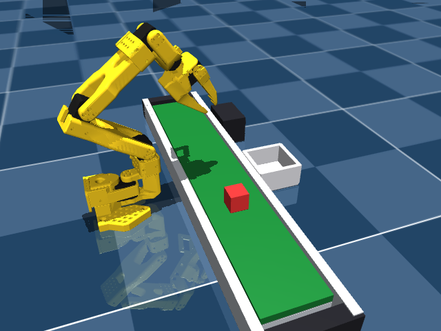

# reactive-vla

English | [日本語](README-ja.md)

first octpus vla project repository

📖 **Documentation:** <https://octpus-vla.github.io/reactive-vla/> — step-by-step guides (setup, SmolVLA fine-tuning, editable lerobot, RTC sim rollout). This README is the command/feature reference; the docs site is the narrative walkthrough.

## Features

- **SO-101 hardware CLI** (`cli/so101.py`, exposed as `pixi run <command>`) — register the leader/follower arms once, then calibrate, teleoperate, record/replay/visualize/edit datasets, and push them to the Hub. See the [command table](#so-101-commands-pixi-run-command) below. The arm registration/teleop flow (`set-port` → `setup-motors` → `calibrate` → `teleop`) follows the pattern in [Adwaver4157/lecture_lerobot_teleop](https://github.com/Adwaver4157/lecture_lerobot_teleop).
- **Imitation-learning fine-tuning** — fine-tune `smolvla_base` or `pi0_base` on a SO-101 dataset (or train a policy from scratch), with optional W&B logging and Hugging Face Hub push. See [Fine-tuning](#fine-tuning) below.
- **HPC batch training** — submit fine-tuning as a PBS job instead of running `pixi run train` interactively. The PBS scripts themselves aren't included in this repo (they bake in site-specific queue/`group_list` settings) — see the template in [Fine-tuning](#fine-tuning) and drop your own under `jobs/` (gitignored).
- **MuJoCo simulation** — a bundled SO-ARM100 model + `sim_so101` robot adapter let you exercise the async RTC rollout path without physical hardware. See [docs/rtc-sim-rollout.md](docs/rtc-sim-rollout.md).
- **Sim success-rate evaluation** (`pixi run sim-eval`) — run a trained policy in the MuJoCo sim and score task success rate / success step (a Lift-style criterion: did the cube get picked up). Add `--repo-id rollout_<name>` to also record video/dataset. See [Inference](#inference) below.

### SO-101 commands (`pixi run <command>`)

| Command | Purpose |
|---|---|
| `set-port leader\|follower` | Detect & save the arm's serial port |
| `arms` | Show registered arms/cameras |
| `check leader\|follower` | Per-motor diagnostic on the saved port |
| `set-camera <name> --index N` | Attach (or remove) a camera on the follower |
| `setup-motors leader\|follower` | Assign Feetech motor IDs |
| `calibrate leader\|follower` | Run `lerobot-calibrate` with the saved port/id |
| `teleop` | Drive both saved arms (`lerobot-teleoperate`) |
| `record --task "..." --repo-id name` | Record a teleoperated dataset |
| `replay --repo-id name --episode N` | Replay a recorded episode on the follower |
| `viz --repo-id name --episode N` | Visualize an episode (frames/states/actions) in Rerun |
| `drop --repo-id name --episodes 0,2` | Delete bad episodes from a local dataset |
| `upload --repo-id name` | Push a local dataset to the Hugging Face Hub |
| `train --repo-id name [--policy act \| --policy-path ...]` | Fine-tune or train a policy (see below) |
| `push-policy --checkpoint ... --repo-id name` | Push a trained checkpoint to the Hub |
| `policy-test --policy ... --repo-id ...` | Offline inference smoke test (no robot needed) |
| `eval --policy ... --task "..." --repo-id rollout_name` | Run a trained policy on the follower and record eval episodes |
| `sim-eval --policy ... [--repo-id rollout_name]` | Run a trained policy in the MuJoCo sim and score success rate / success step |
| `hf-login` / `wandb-login` | One-time login helpers (needed before pushing/logging) |

Run `pixi run <command> --help` for the full flag list. Flags placed after a forwarding command (`teleop`, `record`, `train`, `eval`, `sim-eval`, `replay`) are passed straight through to the underlying `lerobot-*` CLI.

## Setup

This repository pulls in `lerobot` as a git submodule at `third_party/lerobot` and uses pixi's editable install.

### 1. Fetch the submodule

```bash
git submodule update --init --recursive
```

The submodule is referenced over HTTPS (`https://github.com/Octpus-VLA/lerobot.git`), so no SSH key setup is required.

### 2. Set up the environment

```bash
pixi install
```

- [pixi.toml](pixi.toml) registers `osx-arm64` / `linux-64` / `linux-aarch64` under `platforms`. If your machine uses a different architecture, add it with `pixi workspace platform add <platform>`.
- `ffmpeg` is included as a conda dependency, which is required for video decoding (`lerobot[dataset]` / torchcodec).

### 3. Lint / Format

```bash
pixi run lint   # ruff check
pixi run fmt    # ruff format
pixi run fix    # check --fix + format
```

For detailed configuration and how to add custom policies, see [docs/lerobot-editable-setup.md](docs/lerobot-editable-setup.md).

### 4. Tune the lerobot SO-101 setup

See [Adwaver4157/lecture_lerobot_teleop](https://github.com/Adwaver4157/lecture_lerobot_teleop) for details.

1. `pixi run set-port leader` / `pixi run set-port follower` (one-time)
2. `pixi run setup-motors leader` / `pixi run setup-motors follower` (usually not needed)
3. `pixi run calibrate leader` / `pixi run calibrate follower`
4. `pixi run set-camera front --index 6` (attach a camera to the follower)
5. `pixi run set-camera overall --index 4`
6. `pixi run check leader` / `pixi run check follower` (pre-flight diagnostic)
7. `pixi run teleop` to verify motion

## Data collection

`pixi run record` teleoperates with the leader while recording the follower + camera observations, calling `lerobot-record` to build the dataset (the `record` command in `cli/so101.py`).

```bash
pixi run record \
  --task "pick up the red cube and place it in the box" \
  --repo-id lift_red_cube_50episodes \
  --episodes 50 \
  --push
```

### Main options

| Flag | Default | Purpose |
|---|---|---|
| `--task "<prompt>"` | (required) | Natural-language task description stored with the dataset |
| `--repo-id <name>` | optional (required with `--resume`) | Dataset id. If omitted, auto-generates `<task-slug>/<MMDD_HHMM>` (e.g. `--task "pick up the red cube"` → `pick_up_the_red_cube/0620_2015`) — the same nesting convention as `outputs/train/<policy>/<dataset>/<timestamp>`. Since it already contains `/`, `_resolve_repo` treats it as an explicit namespace/name and does *not* prefix your HF user — pushing it to the Hub later would require a real `<task-slug>` namespace |
| `--episodes N` | 5 | Number of episodes to record |
| `--episode-time SEC` | 20 | Seconds per episode before it auto-stops (right-arrow ends one early) |
| `--reset-time SEC` | 5 | Seconds to reset the scene between episodes |
| `--fps N` | 30 | Recording frame rate |
| `--push` / `--no-push` | `--no-push` | Upload the dataset to the Hugging Face Hub after recording (needs `pixi run hf-login`) |
| `--max-rel DEG` | None | Safety cap: max degrees a follower joint may move per control step |
| `--display` / `--no-display` | `--display` | Visualize in the Rerun viewer |
| `--keep-viewer` | off | Leave the Rerun viewer open after exit |
| `--cameras` / `--no-cameras` | `--cameras` | Whether to record camera observations |

### Controls

Recording starts automatically; control it from the (focused) terminal with the arrow keys.

- **→ (right arrow)**: stop the current episode and continue
- **← (left arrow)**: re-record the current episode
- **Esc**: stop the whole session

### Uploading a recorded dataset to the Hugging Face Hub later

If you recorded with `--no-push` (the default) or changed your mind after the fact, push the local dataset later with `upload`.

```bash
pixi run upload --repo-id <name>
```

Add `--private` to create a private repo, or `--tags tag1,tag2` to tag the dataset card.

## Fine-tuning

Fine-tune the pretrained [`lerobot/smolvla_base`](https://huggingface.co/lerobot/smolvla_base) model (450M) on a SO-101 dataset.

### 1. (On HPC) Move to a GPU node

```bash
qsub -I -q interact-g -W group_list=gw13 -l select=1 -l walltime=02:00:00
```

### 2. Run it

```bash
pixi run train \
  --policy-path lerobot/smolvla_base \
  --repo-id Octpus-VLA/<dataset> \
  --batch-size 64 --steps 10000 --save-freq 2000 \
  --job-name smolvla_so101_pickplace --device cuda \
  -- --rename_map='{"observation.images.<camera>": "observation.images.camera1"}'
```

- If your dataset's camera names differ from what `smolvla_base` expects (`camera1`–`camera3`), remap them with `--rename_map`. Any key left out of the map is automatically excluded from training.
- Training output is written to `outputs/train/<policy>/<dataset>/<timestamp>` (gitignored). `--job-name` only sets the W&B display name and has no effect on the directory.

**For long HPC batch runs**, wrap the command above in your own PBS script (adjust the queue/`group_list`/walltime for your site — anything you put under `jobs/` is gitignored, so it won't get pushed). Template:

```bash
#!/bin/bash
#PBS -q short-g
#PBS -W group_list=<your-group>
#PBS -l select=1
#PBS -l walltime=03:00:00
#PBS -N train_smolvla
#PBS -j oe

set -euo pipefail
cd "${PBS_O_WORKDIR:-$(pwd)}"

pixi run train \
  --policy-path lerobot/smolvla_base \
  --repo-id Octpus-VLA/<dataset> \
  --batch-size 64 --steps 10000 --save-freq 2000 \
  --job-name smolvla_so101_pickplace --device cuda \
  -- --rename_map='{"observation.images.<camera>": "observation.images.camera1"}'
```

To pass values via `qsub -v`, wrap them as env vars reading with a default/required check, e.g. `DATASET_REPO="${DATASET_REPO:?DATASET_REPO is required}"`.

### 3. W&B logging / pushing to the Hugging Face Hub (optional)

```bash
pixi run wandb-login   # first time only, for W&B
pixi run hf-login      # first time only, for Hub push

pixi run train \
  --policy-path lerobot/smolvla_base --repo-id Octpus-VLA/<dataset> \
  --wandb --wandb-project <project> \
  --push-repo-id <name> \
  -- --rename_map='{"observation.images.<camera>": "observation.images.camera1"}'
```

Omitting `--wandb-project`/`--wandb-entity` logs to the default project/your personal account. A bare name passed to `--push-repo-id` is automatically prefixed with your HF username. To push after the fact instead, use `pixi run push-policy --checkpoint <checkpoint-dir> --repo-id <name>`.

### 4. Verify with offline inference (no robot needed)

```bash
pixi run policy-test \
  --policy outputs/train/smolvla_base/<dataset>/<timestamp>/checkpoints/last/pretrained_model \
  --repo-id Octpus-VLA/<dataset> \
  --rename_map='{"observation.images.<camera>": "observation.images.camera1"}'
```

This feeds recorded dataset frames into the fine-tuned policy and reports inference latency and the deviation from the recorded actions (`mean |action - recorded|`, in degrees). If you used `--rename_map` during training, pass the same `--rename_map` here too — omitting it leaves the dataset's keys (e.g. `front`/`overall`) mismatched against what the checkpoint expects (`camera1`–`camera3`), raising `Feature mismatch between dataset/environment and policy config`.

**This is an offline smoke test, nothing more.** Don't just check the default `--episode 0` — try a few different `--episode` values and watch for any episode with an unusually large deviation. Neither a low nor a high deviation alone proves training "worked" or "failed": `--episode 0` is training data, so a low deviation could just mean the policy memorized it. Confirm real success with an on-robot `eval` run (see [Inference](#inference)).

For batch runs on HPC, wrap the command above in your own PBS script under `jobs/` (gitignored), the same way as the training job.

Reference: [SmolVLA fine-tuning guide](https://huggingface.co/docs/lerobot/en/smolvla)

### pi0 (`lerobot/pi0_base`)

Swap `--policy-path lerobot/smolvla_base` for `--policy-path lerobot/pi0_base` and the same steps apply, with two differences.

- **Camera names are fixed here too.** Like `smolvla_base`, `pi0_base`'s input features are fixed to `observation.images.base_0_rgb`, `left_wrist_0_rgb`, and `right_wrist_0_rgb` (the OpenPI/DROID base + two wrist cameras convention) — it does *not* dynamically read whatever camera names your dataset happens to use. If your dataset's keys differ, you need `--rename_map` (e.g. `'{"observation.images.front": "observation.images.base_0_rgb"}'`). Any expected camera you don't map is automatically padded with a masked dummy image.
- `--batch-size` should be lowered to around 4–8 given the larger model size. `pi0_base` defaults to `train_expert_only=false`, `freeze_vision_encoder=false`, and `use_amp=false` (full fp32 fine-tuning of all 4B params), so weights + gradients + AdamW optimizer state (m, v) alone cost a **fixed ~64GB** (4.03B × 4 bytes × 4) regardless of batch size. So "GB per batch element" isn't a linear estimate — only the activation memory scales with batch size. Headroom depends on your GPU's VRAM, so it's worth a short trial run to find the real ceiling: `pixi run train --policy-path lerobot/pi0_base --repo-id Octpus-VLA/<dataset> --batch-size 6 --steps 10 --device cuda -- --rename_map='{"observation.images.front": "observation.images.base_0_rgb"}'`. If you need to fit a bigger batch, these flags free up memory (roughly in order of impact): `-- --policy.train_expert_only=true` (freeze the VLM, train only the action expert), `-- --policy.freeze_vision_encoder=true`, `-- --policy.gradient_checkpointing=true`, `-- --policy.use_amp=true`.

> **Prerequisite**: `pi0_base`'s tokenizer uses Google's gated repo [`google/paligemma-3b-pt-224`](https://huggingface.co/google/paligemma-3b-pt-224). Accept the license on that page, and if your HF token is a **fine-grained** token, enable "Read access to contents of all public gated repos you can access" under the token's **global** settings (separate from per-repo `scoped` permissions — those alone won't grant access to a gated repo outside your own namespace). A plain non-fine-grained **Read** token works too if that's simpler. Confirmed working end-to-end with the setup above.

## Inference

### Real hardware

```bash
pixi run eval --policy <checkpoint> --task "..." --repo-id rollout_<name>
```

Runs the policy on real hardware and records evaluation episodes (internally `lerobot-rollout --strategy.type=episodic --inference.type=sync`, i.e. synchronous inference). Eval dataset repo-ids must use the **`rollout_` prefix**, not `eval_` (e.g. `rollout_test`).

Async RTC (Real-Time Chunking) rollout is currently **MuJoCo-sim only** ([docs/rtc-sim-rollout.md](docs/rtc-sim-rollout.md)). There's no wrapper for it in `cli/so101.py`, so trying it on real hardware means assembling `lerobot-rollout --robot.type=so101_follower --robot.port=... --robot.id=... --robot.cameras='{...}'` by hand (equivalent to swapping `--robot.type` in the sim commands).

For moving-cube trials, the RTC detector can use the `front` camera as a visibility gate. With `--require-target-visible`, queue-based replanning is held back until `red_cube_speed` sees the red cube, preventing the policy from planning on an observation where the target is not yet in view:

```bash
pixi run eval --rtc --detector red_cube_speed --detector-camera front --require-target-visible \
  --policy <checkpoint> --task "pick up the red cube" --repo-id rollout_front_gate
```

### Simulation



```bash
# static pick — belt stopped (default), cube parked in front of the robot, graspable
pixi run sim-eval --policy <checkpoint> --episodes 10 --episode-time 30 --task "Grab the cube"

# dynamic pick — belt running: the cube is fed from the -y end and carried across the front
pixi run sim-eval --policy <checkpoint> --belt-speed 0.06 --episode-steps 600 --task "Grab the cube"

# move the whole belt + box + cube layout (meters from the robot base to the belt's near edge)
pixi run sim-eval --policy <checkpoint> --belt-distance 0.18

# add --repo-id to also record a video/dataset (id must start with 'rollout_')
pixi run sim-eval --policy <checkpoint> --repo-id rollout_sim_test
```

Runs the policy against the bundled MuJoCo SO-101 model (`assets/so101/scene_cube.xml`, DeepMind Menagerie's `robotstudio_so101` — the real SO-101's own CAD-derived model, not the older SO-ARM100) instead of real hardware, and scores task success: a robosuite/LIBERO-style **Lift criterion** — success once the cube's z-position rises `--success-height` (default 0.05m) above where it rested at connect time. This is read directly from privileged sim state and never shown to the policy. Each run writes a JSON summary (`success_rate`, `mean_success_step`, and a per-episode breakdown) to `outputs/eval/<policy-slug>/<timestamp>/summary.json` (override with `--output`).

`sim-eval` uses two sim cameras: `camera1=wrist_cam` (the upstream model's built-in eye-in-hand camera at the real SO-101's CAD-derived wrist mount — fed to the policy, matching the real rig's only visual input) and `overview` (a fixed external view added in `scene_cameras.xml`, *not* fed to the policy, but recorded into the dataset with `--repo-id` for a future cube-position/velocity predictor). If the policy expects more cameras than `camera1` (`camera2`/`camera3`), the missing ones are automatically padded with a masked dummy image.

No recording happens unless `--repo-id` is given — by default `sim-eval` only measures success rate / success step. Add `--rtc` to evaluate with async RTC inference instead of the default sync engine.

`--episode-time` is a wall-clock budget, not sim time — how many steps actually fit in it depends on render/inference speed (CPU-rendering SO-101's meshes measured at ~374ms/call for both cameras). Add `--episode-steps N` for a reproducible step count regardless of speed; an episode ends at whichever of `--episode-time` / `--episode-steps` is hit first (e.g. `--episode-steps 600` for ~20s of sim time at `--fps 30`).

`scene_cube.xml` also sets up the dynamic pick-and-place scene (toward this project's research goal), laid out front-to-back along `+x`: **robot (origin) → green conveyor belt (center `x=0.19`, near edge 14 cm from the base) → white drop-off box (center `x=0.30`)**, all within the arm's ~0.40 m reach. The belt is modeled after a real tabletop unit — a static frame (aluminium base/side rails, dark end caps, motor box) plus a moving green surface that runs as a *treadmill*: a velocity-actuated slide joint drives it, but `SimSO101.send_action()` zeroes its position every control step, so the green never visibly drifts (the static frame is what reads as a belt) while friction still drags the resting cube along at belt speed. **`--belt-speed M_PER_S`** sets the belt speed (constant for the whole rollout, default `0` = stationary), and also decides where the cube starts:
- **stationary (`--belt-speed 0`, the default)** — the cube is parked directly **in front of the robot** (`y=0`), graspable on the spot, for static pick evaluation.
- **running (`--belt-speed > 0`)** — the cube is fed from the belt's `-y` end and carried through the reachable region (the arm's home pose faces the front-center where it crosses); the belt spans `y∈[-0.30, 0.30]`, so an un-picked cube falls off the `+y` end like a real conveyor.

**`--belt-distance M`** (default `0.14` = 14 cm from the robot base to the belt's near edge) slides the whole belt + box + cube layout forward/back together; keep the cube within the arm's ~0.40 m reach. The white box is where picked cubes are meant to go, but **box-placement success detection isn't implemented yet** (success is still the lift criterion above).

`sim-eval` sets `MUJOCO_GL=osmesa` (CPU rendering) by default, not `egl` (GPU). Measured on a GH200 node: rendering and CUDA policy inference contending for the same GPU under `egl` stalled individual render calls by ~19s, while plain CPU rendering (~80ms/frame) has no such contention and was ~80x faster end to end. Override with `export MUJOCO_GL=egl` if you have a setup where that doesn't apply (e.g. rendering and inference on separate GPUs). See [docs/rtc-sim-rollout.md](docs/rtc-sim-rollout.md) for more on the sim setup, and note this is still an early integration: the bundled cube placement / camera framing are provisional, and a policy trained on real hardware images shouldn't be expected to succeed zero-shot in the sim's rendered observations.

## Roadmap

### Target task

- Grasp an object moving on a belt conveyor and place it in a box.
- The belt speed should vary across multiple settings.
- A new detector, built from image input, flags when an object is approaching; on detection it requests the VLA to regenerate its Action Chunk, reacting faster than the default queue-size-based replanning.
- Both the VLA (assumed `smolvla_base`) and the detector need training.
- The detector's implementation is undecided; the goal is a pluggable design so any detector implementation can be swapped in.

### What's missing

1. **The conveyor itself**: no variable-speed belt conveyor, and no way to record/reproduce its speed setting.
2. **A task dataset**: the existing `lerobot/svla_so101_pickplace` is static pick & place. A new dataset covering pickup-from-belt → place-in-box needs to be collected.
3. **No detector implementation exists yet**: inputs (image only, or also joint state?) and outputs (approach flag / distance / bbox) are undecided. A pluggable design needs an abstract detector interface (a swappable protocol) added on the `lerobot` fork side.
4. **No event-driven trigger path from detector to RTC**: the current RTC engine (`rollout/inference/rtc.py`) only replans based on `queue_threshold` (remaining queue size). There's no hook yet for "force an immediate replan the moment the detector fires" (e.g. a `force_replan()` method).
5. **No training data for the detector**: no pipeline exists for collecting/labeling "object is approaching" data.
6. **No evaluation protocol for variable belt speed**: no tooling to compare success rate across different belt speeds (the existing `eval` only records episodes; it doesn't auto-score success/failure).
7. **RTC itself is unverified on real hardware**: it has only been exercised in simulation, never run against `so101_follower`.

## Troubleshooting

Use `qstat` to check running jobs.
