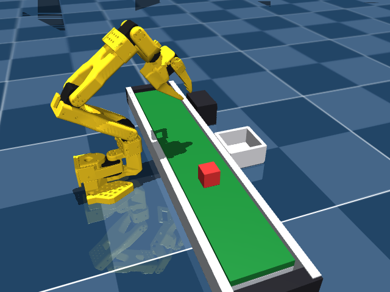
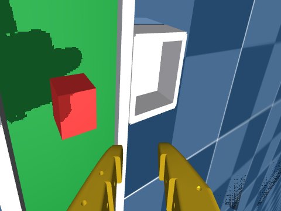

# reactive-vla

[English](README-en.md) | 日本語

## 概要

reactive-vla は、ベルトコンベア上を動く物体を掴んで箱に入れる、といった動的なピック&プレースタスクに取り組む VLA（Vision-Language-Action）制御の研究プロジェクトである。`lerobot` をベースに、SmolVLA / pi0 のアクションチャンク方式の模倣学習を、実機（SO-101 ロボットアーム）と MuJoCo シミュレーションの両方で記録・学習・評価できる CLI/ワークフローをこのリポジトリで提供する。

リアクティブ制御は、既存のアクションキュー残量に基づく再計画をベースラインに、カメラ supervisor によるイベント駆動の早期再計画、cube の位置・速度・推定把持タイミングから動的に有効ホライズンを決める予測的な再計画へと段階的に拡張していく設計である。各段階の呼称（プロジェクト内では Tier 1〜3 と呼ぶ）は [CLAUDE.md](https://github.com/Octpus-VLA/reactive-vla/blob/main/CLAUDE.md) を参照。

📖 **ドキュメント:** <https://octpus-vla.github.io/reactive-vla/> — セットアップ・SmolVLAファインチューニング・lerobot editable構成・RTC simロールアウトの手順ガイドはこちら。この README はプロジェクト概要、詳しい使い方は各ディレクトリのドキュメントという役割分担である。

## シミュレーション環境

MuJoCo 上に実機 SO-101 と同じCAD由来のモデル（DeepMind Menagerieの`robotstudio_so101`）を組み込み、コンベアベルト・cube・配置先の箱からなる動的ピック&プレースのシーンを用意している。実機無しでポリシー評価や RTC 非同期ロールアウトを試せる。

| 外部カメラ視点（`overview`、記録用） | 手首カメラ視点（`wrist_cam`、ポリシー入力） |
|---|---|
|  |  |

詳細は [docs/rtc-sim-rollout.md](docs/rtc-sim-rollout.md) を参照。

## 機能一覧

- **SO-101 実機操作 CLI**（`cli/so101.py`、`pixi run <command>` として公開）— leader/follower アームを一度登録すれば、以降はキャリブレーション・テレオペ・データセットの記録/再生/可視化/編集・Hubへのアップロードまで行える。詳細は [cli/README.md](cli/README.md#so-101-コマンド-pixi-run-command) のコマンド一覧を参照。
- **模倣学習ファインチューニング** — SO-101 データセットで `smolvla_base` / `pi0_base` をファインチューニング（またはスクラッチ学習）。W&Bロギング・Hugging Face Hubへのpushにも対応。詳細は [cli/README.md](cli/README.md#ファインチューニング) を参照。
- **HPCバッチ学習** — `pixi run train` をインタラクティブに実行する代わりに、PBSジョブとして投入できる。PBSスクリプト自体はキュー名・`group_list` などサイト固有の設定を含むため、このリポジトリには含めていない。[cli/README.md](cli/README.md#ファインチューニング) のテンプレートを自分のサイト向けに調整して `jobs/` 以下に置くこと（`jobs/` は `.gitignore` 済み）。
- **MuJoCoシミュレーション** — 同梱の SO-101 モデルと `sim_so101` ロボットアダプタにより、実機無しで RTC 非同期ロールアウト経路を検証できる。詳細は [docs/rtc-sim-rollout.md](docs/rtc-sim-rollout.md) を参照。
- **シム上での成功率評価**（`pixi run sim-eval`）— 学習済みポリシーをMuJoCoシム上で実行し、タスク成功率・成功ステップ数を計測（Lift基準: cubeを持ち上げたか）。`--repo-id rollout_<name>` を付ければ動画/データセットも録画できる。詳細は [cli/README.md](cli/README.md#推論) を参照。
- **シム上でのデモ収集**（`pixi run sim-collect`）— 特権状態を使うスクリプトIKエキスパートがMuJoCoシム内で pick-and-place を実演し、(観測, アクション) を `record` と同形式の `LeRobotDataset` に書き出す。実機データで学習したポリシーは sim レンダリング観測に対して分布外（real→sim 視覚ギャップ）なので、このシム観測データでファインチューニングしてギャップを埋めるのが狙い。詳細は [docs/sim-scripted-collect.md](docs/sim-scripted-collect.md) を参照。

## セットアップ

このリポジトリは `lerobot` を `third_party/lerobot` に git submodule として取り込み、pixi の editable install で利用する。

### 1. submodule の取得

```bash
git submodule update --init --recursive
```

submodule は HTTPS (`https://github.com/Octpus-VLA/lerobot.git`) で参照しているため、SSH鍵の設定は不要。

### 2. 環境構築

```bash
pixi install
```

- [pixi.toml](pixi.toml) の `platforms` には `osx-arm64` / `linux-64` / `linux-aarch64` を登録している。利用するマシンのアーキテクチャがこれら以外の場合は `pixi workspace platform add <platform>` で追加すること。
- 動画デコード（`lerobot[dataset]` / torchcodec）に必要な `ffmpeg` も conda 依存として含めている。

### 3. Lint / Format

```bash
pixi run lint   # ruff check
pixi run fmt    # ruff format
pixi run fix    # check --fix + format
```

詳細な構成・カスタムポリシー追加手順は [docs/lerobot-editable-setup.md](docs/lerobot-editable-setup.md) を参照。

SO-101 アーム自体の初期登録・キャリブレーション手順は [cli/README.md](cli/README.md#so-101-アームの初期登録) を参照。

## 詳細ドキュメント

- **CLIコマンドの全リファレンス**（記録・学習・推論の詳しいフラグ、PBSテンプレート等）→ [cli/README.md](cli/README.md)
- **手順ガイド**（セットアップ・ファインチューニング・RTC simロールアウト・レイテンシ実験など読み物形式）→ [ドキュメントサイト](https://octpus-vla.github.io/reactive-vla/)
- **SO-101 ロボット本体・シミュレーション資産**（MJCFモデル、写真、ライセンス）の詳しい説明 → [assets/so101/README.md](assets/so101/README.md)

## ライセンス

このリポジトリは [Apache License 2.0](LICENSE) の下で公開されている。`assets/so101` 配下の SO-101 ロボット記述（MJCF）は別配布物（同じく Apache License 2.0）— 詳細は [assets/so101/LICENSE](assets/so101/LICENSE) を参照。
