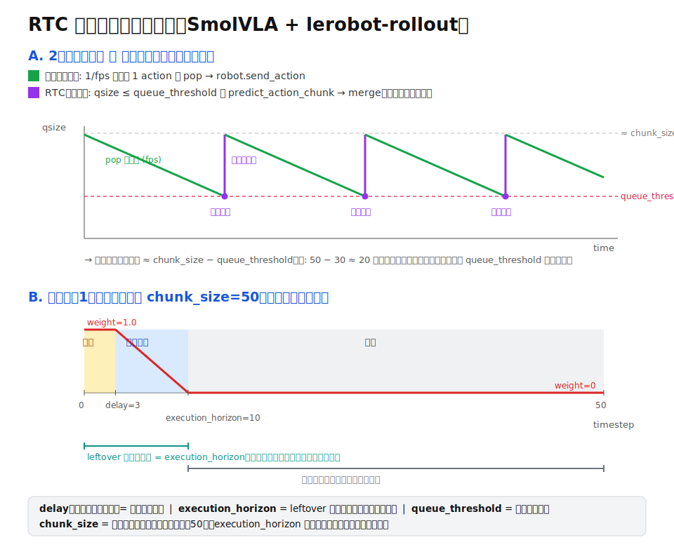

# RTC 非同期実行の仕組み（SmolVLA + lerobot-rollout）

このフォークの Real-Time Chunking (RTC) 非同期推論が、どのパラメータで何を制御しているかの早見メモ。



## 登場する3+1パラメータの役割（混同しやすい）

| パラメータ | 既定 | 何を決めるか | 出どころ |
|---|---|---|---|
| `chunk_size` | 50 | キューに積む実行ステップ数（`predict_action_chunk` の返り長） | smolvla config |
| `queue_threshold` | 30 | **いつリプランするか**（残量がこれ以下で再推論）。実効リプラン間隔 ≈ `chunk_size − queue_threshold` | `RTCInferenceConfig.queue_threshold` |
| `execution_horizon` | 10 | **leftover を使う長さ**＝ガイダンスのブレンド終端。キュー長は決めない | `RTCConfig.execution_horizon` |
| `delay`（≒inference_delay） | 実測 | leftover の中で**先頭を何ステップ凍結するか** = `ceil(latency / (1/fps))` | レイテンシ実測 |

## 2スレッドの流れ

- **メインループ**（`rollout/strategies/base.py`）: `1/fps` ごとにキューから 1 action を pop → `robot.send_action`。
- **RTCスレッド**（`rollout/inference/rtc.py` の `_rtc_loop`）: `qsize ≤ queue_threshold` になったら `predict_action_chunk(inference_delay=delay, prev_chunk_left_over=leftover)` を実行し、`ActionQueue.merge` でキューを差し替え（先頭 `new_delay` ステップは破棄）。

→ qsize は「リプラン直後 ≈ chunk_size − new_delay」から `queue_threshold` まで減り、また補充、を繰り返す（図A）。

## 1チャンクの中の重み付け（図B）

`get_prefix_weights(start=delay, end=execution_horizon, total=chunk_size)`（LINEAR）：

```
timestep:  0 .. delay │ delay .. execution_horizon │ execution_horizon .. chunk_size
weight:      1.0       │      1.0 → 0.0（線形）       │            0.0
領域:        凍結       │        ブレンド               │            自由
```

- **凍結（weight=1.0）**: 推論中に実機が実行してしまう先頭 `delay` ステップ。変更不可なので前チャンク(leftover)に完全一致させる。
- **ブレンド（1→0）**: 旧チャンクから新チャンクへ滑らかに移行し、接合部の不連続を防ぐ。
- **自由（weight=0）**: `execution_horizon` 以降。前チャンクを無視して新観測で自由に生成。

この重みを使い、各 denoising ステップで `correction = grad((leftover − x1_t) * weights)` を計算し `v_t − guidance_weight·correction` で前チャンクへ引き寄せる（`policies/rtc/modeling_rtc.py`）。

## 一言でいうと

- **leftover の長さ** → `execution_horizon`
- **leftover の中の凍結幅** → `delay`
- **リプラン頻度** → `queue_threshold`
- **キューに積む実行ステップ数** → `chunk_size`

`execution_horizon` は名前に反して「リプラン間隔」でも「キュー長」でもなく、**ガイダンスの及ぶ範囲**を決めるパラメータ。
