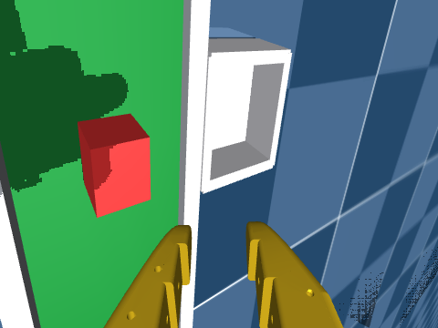
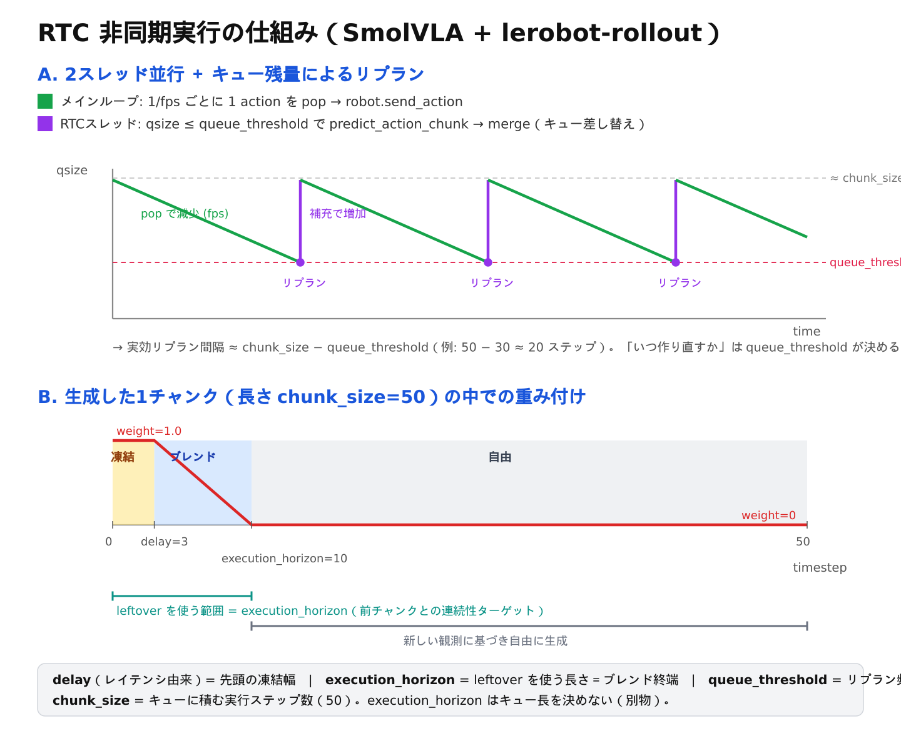

# SmolVLA + RTC 非同期ロールアウト（実機 / シミュレーション）

`lerobot-rollout --inference.type=rtc`（非同期 Real-Time Chunking）でファインチューニング済み SmolVLA を動かすための一通り。**最終ゴールは実機 SO-101** で、同じパイプラインを MuJoCo シミュレーションでも流せる。

- **実機 SO-101**: 登録済みアームに対し `pixi run eval --rtc` で起動するのが最短。[簡易実行（実機 SO-101・最短）](#最短)を参照。
- **シミュレーション**: ハードウェア無しで配線と RTC 非同期挙動を検証する。`--robot.type=sim_so101` で同じパイプラインをシムで流す（[3. ロールアウト](#3-rollout)以降）。

RTC 経路は `Robot` 抽象を要求する実機前提の作りで、シムは MuJoCo を裏に持つ `Robot`（`sim_so101`）を1個用意して同じ経路を流している。アダプタを実機ドライバ（`so101_follower`）に差し替えれば実機へ移行できる。GH200 ノードで sim の end-to-end 動作を確認済み（学習 → sim 接続 → オフスクリーン描画 → RTC 非同期ロールアウト → 録画）。実機 RTC 経路はコード上は通っているが、実機での動作検証は未実施。

---

## 簡易実行（実機 SO-101・最短） {#最短}

アームとカメラを一度登録しておけば（[セットアップ](setup.md) / `pixi run set-port follower` / `pixi run calibrate follower` / `pixi run set-camera ...`）、RTC 非同期ロールアウトは **`--rtc` を付けるだけ**で起動できる。`pixi run eval` は登録済み follower の port / id / cameras と安全上限・データセット命名を自動で組み立てる（[`cli/so101.py`](https://github.com/Octpus-VLA/reactive-vla/blob/main/cli/so101.py) の `evaluate`）。

```bash
# 同期推論（従来どおり）
pixi run eval --policy <ckpt> --task "Grab the cube" --repo-id rollout_test

# 非同期 RTC（--rtc を足すだけ。横で再推論しながら実行）
pixi run eval --rtc --policy <ckpt> --task "Grab the cube" --repo-id rollout_rtc_test

# horizon / 再推論しきい値を変える + 急な動きを抑える安全上限（推奨）
pixi run eval --rtc --execution-horizon 10 --queue-threshold 30 --max-rel 5 \
  --policy <ckpt> --task "Grab the cube" --repo-id rollout_rtc_test

# overhead predictor を足すと、推論レイテンシ（PE gap）分だけ赤 cube を進めた
# 画像を VLA に入力する（時間前進観測）
pixi run eval --rtc --predict-cube --predictor-camera overall \
  --policy <ckpt> --task "Grab the cube" --repo-id rollout_rtc_predict
```

- `<ckpt>` は学習で出た `outputs/train/.../checkpoints/last`（`pretrained_model` は自動補完）または Hub の `user/name`。
- `--rtc` を付けると内部で `--inference.type=rtc --inference.rtc.execution_horizon=… --inference.queue_threshold=… --policy.rtc_config.enabled=true --policy.rtc_config.execution_horizon=…` に展開される（horizon はポリシー側・エンジン側を自動で一致させる。理由は[オプション解説](#opts)の注記）。
- `--repo-id` は `rollout_` で始める必要がある（lerobot の制約）。エピソード間に follower は自動で初期姿勢へ戻る（leader 不要）。
- 自律実行では **`--max-rel`（1ステップの最大移動量 deg）を付けて急な動きを抑える**のを推奨。
- `--predict-cube` は **`--rtc` と併用が前提**。`--inference.predictor.enabled=true --inference.predictor.camera=…` に展開される。監視する overhead カメラは `--predictor-camera` で指定（既定は登録済みカメラの `overall`、無ければ先頭）。cube マスクの調整は passthrough で渡す（例 `--inference.predictor.cube.min_area_ratio=0.002`）。仕組みは [overhead カメラ予測器による動的 pick](overhead-predictor.md) を参照。

下層の生コマンドや引数の意味は [実機 SO-101 で動かす（生コマンド）](#raw) と [オプション解説](#opts) を参照。

---

## 全体フロー

```
1. セットアップ   実機: アーム/カメラ登録 ・ sim: assets 同梱モデル + pixi install + MUJOCO_GL=egl
2. 学習           lerobot-train で普通の SmolVLA を作る（RTC は学習に不要）
3. ロールアウト   lerobot-rollout --inference.type=rtc を実機 / シムで走らせる
   └ 録画する場合は --strategy.type=episodic で MP4 / データセットを保存
```

---

## 1. セットアップ

### MuJoCo モデル（リポジトリ同梱・clone 不要）

DeepMind Menagerie の SO-101（`robotstudio_so101`、Apache-2.0）を `assets/so101/` に同梱済み。実機と同じ The Robot Studio SO-101（旧SO-ARM100ではない）の公式CAD由来モデルで、actuator/joint 名（`shoulder_pan/shoulder_lift/elbow_flex/wrist_flex/wrist_roll/gripper`）が `so101_follower` のモーター名と一致するため `SimSO101Config.joint_map` は恒等写像。

- `scene_cameras.xml` … upstream `scene.xml` に、プロジェクト追加の固定外部カメラ `overview` を足したもの。**ロールアウトではこれを使う**
- `scene_cube.xml` … `scene_cameras.xml` に掴む対象の `cube`（free joint）と `home` キーフレームを足したもの。**`sim-eval` ではこれを使う**
- `scene.xml` / `scene_box.xml` … upstream そのまま（`scene_box.xml` は別の掴み対象 `box` 付きのデモシーン、本プロジェクトでは未使用）
- `so101.xml` + `assets/` … モデル本体。`gripper` ボディの子に upstream 定義済みの手首カメラ `wrist_cam` がある（実機SO-101の手首マウントカメラの実CADデータに基づく、プロジェクトでの追加調整は無し）

カメラは2種類: `overview`（固定の外部視点、プロジェクト追加）と `wrist_cam`（グリッパーに追従するeye-in-hand視点、upstream添付の実CADマウント）。`pixi run sim-eval`の既定は **`camera1=wrist_cam`**（実機SO-101の唯一の視覚入力＝手首カメラに対応、ポリシーに渡す）と **`overview`**（固定外部視点、現行ポリシーには渡さず`--repo-id`での録画時にデータセットへ残すだけ。今後のcube位置/速度predictor用）。

> `overview` カメラの位置・向きと `cube` の配置は実際に `SimSO101` でレンダリングしながら経験的に決めた値（`wrist_cam` は upstream 定義のため未調整）。シーン構成を変えた場合は要調整。

**初期姿勢は `home` キーフレーム**（`scene_cube.xml` に定義）を使う。upstream の qpos=0（全関節ゼロ）はアームが直立し、`wrist_cam` がほぼ水平に部屋の奥を見るだけで、リーチ範囲内のどこも映らない（録画で確認済み: 全フレームで cube が一度も映らなかった）。joint の `ref` 属性はこれを解決しない（`ref` は qpos の数値の意味を再定義するだけで、実際の静止姿勢は変えない — 同じ pos/quat になる）。`SimSO101.connect()` は MJCF に `home` という名前の `<key>` があれば `mj_resetDataKeyframe` で適用し、なければ qpos=0 にフォールバックする。

### 環境とレンダラ

```bash
pixi install                 # pixi.toml の mujoco を導入
export MUJOCO_GL=egl         # ヘッドレスGPU描画。ダメなら osmesa（CPU描画）にフォールバック
```

---

## 2. 学習: SmolVLA チェックポイントを作る

**RTC は推論時のテクニックなので、学習側に RTC 用の処理は一切不要**（普通の SmolVLA ファインチューニングでよい）。RTC の有無はロールアウト時に切り替える。

GPU ノードでの学習は PBS ジョブ [`jobs/train_smolvla.pbs`](https://github.com/Octpus-VLA/reactive-vla/blob/main/jobs/train_smolvla.pbs) を使う（リポジトリ root から投入）：

```bash
qsub jobs/train_smolvla.pbs                       # 既定: 20000 steps, save_freq=2000, short-g(<=8h)
qsub -v STEPS=10000 jobs/train_smolvla.pbs        # 配線確認なら steps を減らして高速に
qsub -v RESUME=outputs/train/smolvla_base/svla_so101_pickplace/<タイムスタンプ>/checkpoints/last jobs/train_smolvla.pbs
                                                   # walltime で切れた後、最後のckptから再開
qsub -l walltime=06:00:00 -q small-g jobs/train_smolvla.pbs   # 長時間ジョブ
```

監視 `qstat -u $USER`、ログは投入ディレクトリの `train_smolvla.o<jobid>`。完了すると `outputs/train/smolvla_base/svla_so101_pickplace/<タイムスタンプ>/checkpoints/last/pretrained_model` が生成され、ロールアウトの `--policy.path` にそのまま渡せる（実際のパスはログの `--output_dir=...` で確認）。

インタラクティブに直接回すなら（ジョブ不要、内部で `lerobot-train` を呼ぶ CLI ラッパー `pixi run train` を使う）：

```bash
pixi run train \
  --policy-path lerobot/smolvla_base \
  --repo-id lerobot/svla_so101_pickplace \
  --batch-size 64 --steps 10000 --save-freq 2000 \
  --device cuda \
  -- --rename_map='{"observation.images.up": "observation.images.camera1", "observation.images.side": "observation.images.camera2"}'
```

**学習のハマりどころ（実測）**

- **`--save-freq` を小さく刻む**。既定は `20000` ＝途中保存ゼロで、walltime に殺されると全ロスト。`2000` 推奨。
- **walltime はステップ数に対し十分に**。GH200 で約 3.45 step/s（20000 steps ≈ 1h40m + データロード）。`interact-g`（上限2h）はギリギリなので 20000 はバッチ（`short-g`）が無難。
- **Hub に上げない場合は何も指定しなくてよい**（`pixi run train` は `--push-repo-id` を渡さない限り `--policy.push_to_hub=false` を自動付与）。上げる場合は `--push-repo-id <name>` + `HF_TOKEN`（`pixi run hf-login`）。
- **再開**は `pixi run train --resume <output_dir>/checkpoints/last` の1コマンドでよい（内部で `--config_path=.../pretrained_model/train_config.json --resume=true` に展開される）。非 resume 実行で同じ `output_dir` が既存だとエラーになるが、`output_dir` は実行ごとにタイムスタンプが付くため通常は衝突しない。

---

## 3. ロールアウト {#3-rollout}

実機・シムとも同じ `lerobot-rollout` を使い、`--robot.type` だけを差し替える（実機 `so101_follower` / シム `sim_so101`）。実機は `pixi run eval --rtc` が最短（[簡易実行](#最短)）。以下はその下層で何が走っているかと、シムでの動かし方。

### 実機 SO-101 で動かす（生コマンド） {#raw}

`pixi run eval --rtc` を使わず素の `lerobot-rollout` を直接叩く場合。前提として follower のキャリブレーション（`pixi run calibrate follower`、`~/.cache/huggingface/lerobot/calibration/so_follower/<id>.json` に保存）とシリアルポート権限（`/dev/ttyACM*`、`dialout`/`uucp` グループ）が必要。

```bash
lerobot-rollout \
  --robot.type=so101_follower \
  --robot.port=/dev/ttyACM0 \
  --robot.id=<follower-id> \
  --robot.cameras='{ front: {type: opencv, index_or_path: 0, width: 640, height: 480, fps: 30}, side: {type: opencv, index_or_path: 2, width: 640, height: 480, fps: 30}}' \
  --robot.max_relative_target=5 \
  --policy.path=outputs/train/.../checkpoints/last/pretrained_model \
  --policy.rtc_config.enabled=true --policy.rtc_config.execution_horizon=10 \
  --inference.type=rtc --inference.rtc.execution_horizon=10 --inference.queue_threshold=30 \
  --strategy.type=episodic \
  --dataset.repo_id=local/rollout_rtc_real --dataset.num_episodes=10 --dataset.fps=30 \
  --dataset.push_to_hub=false \
  --fps=30 --task="Grab the cube"
```

**実機のハマりどころ・前提**

- **カメラキー名（`front`/`side` など）は学習データと一致必須**。`--robot.cameras` の各キーは学習時の `observation.images.<key>` に対応する（不一致だと観測が埋まらない）。`pixi run eval --rtc` は登録済みカメラからこれを自動生成する。
- **`--robot.max_relative_target`（=`--max-rel`）で1ステップの最大移動量を制限**。自律実行で急なモーションを防ぐ安全策。
- **`--robot.id` は `pixi run calibrate follower` で作った ID**。未キャリブレーションだと接続時に自動キャリブが走る。
- エピソード間 follower は自動で初期姿勢へ戻る（`--return_to_initial_position` 既定 true）。切断時はトルク解放（`disable_torque_on_disconnect` 既定 true）。
- 実機 RTC の凍結区間は推論レイテンシで自然に発生する（sim 同様）。`execution_horizon` はポリシー側・エンジン側を一致させる（[オプション解説](#opts)の注記）。

### 動作確認（シミュレーション・録画なし・base 戦略）

```bash
export MUJOCO_GL=egl
pixi run lerobot-rollout \
  --policy.path=outputs/train/smolvla_base/svla_so101_pickplace/<タイムスタンプ>/checkpoints/last/pretrained_model \
  --policy.rtc_config.enabled=true --policy.rtc_config.execution_horizon=10 \
  --robot.type=sim_so101 \
  --robot.mjcf_path=$PWD/assets/so101/scene_cube.xml \
  --robot.cameras='{camera1: {mujoco_name: wrist_cam, width: 320, height: 240}, camera2: {mujoco_name: overview, width: 320, height: 240}}' \
  --robot.control_fps=30 \
  --inference.type=rtc --inference.rtc.execution_horizon=10 --inference.queue_threshold=30 \
  --fps=30 --task="Grab the cube" --duration=30
```

### 録画する（episodic 戦略 → MP4）

カメラ映像を LeRobotDataset に保存する。base との差分は太字の4つ：

```bash
export MUJOCO_GL=egl
pixi run lerobot-rollout \
  --policy.path=outputs/train/smolvla_base/svla_so101_pickplace/<タイムスタンプ>/checkpoints/last/pretrained_model \
  --policy.rtc_config.enabled=true --policy.rtc_config.execution_horizon=10 \
  --robot.type=sim_so101 \
  --robot.mjcf_path=$PWD/assets/so101/scene_cube.xml \
  --robot.cameras='{camera1: {mujoco_name: wrist_cam, width: 320, height: 240}, camera2: {mujoco_name: overview, width: 320, height: 240}}' \
  --robot.control_fps=30 \
  --inference.type=rtc --inference.rtc.execution_horizon=10 --inference.queue_threshold=30 \
  --fps=30 --task="Grab the cube" \
  --strategy.type=episodic \
  --dataset.repo_id=local/rollout_sim_rtc_eval \
  --dataset.root=outputs/rollout/rollout_sim_rtc_eval \
  --dataset.num_episodes=1 --dataset.episode_time_s=30 \
  --dataset.push_to_hub=false \
  --play_sounds=false
```

出力 → `outputs/rollout/rollout_sim_rtc_eval/videos/.../observation.images.camera1/episode_000000.mp4`（camera2 も同様）。

**ロールアウトのハマりどころ（実測）**

- **`--play_sounds=false` が必須**（HPC）。既定 `true` だと `spd-say`（音声合成）を起動しようとして `FileNotFoundError` でクラッシュする。
- **`--dataset.repo_id` は `rollout_` で始める**必要がある（例 `local/rollout_*`）。違うと検証エラー。
- **`--dataset.push_to_hub=false`** を明示（既定 `true`）。
- `pynput` 無し（`Headless environment detected`）はそのまま。`episode_time_s` 経過で自動終了する。

---

## 評価（成功率 / 成功ステップ数） {#eval-success-rate}

`--strategy.type=eval`（CLI ラッパーは `pixi run sim-eval`）で、複数エピソードを流して **成功率** と **成功ステップ数**（何ステップ目で成功したか）を集計できる。


左から SO-101 アーム → 緑のコンベアベルト（赤い cube が乗る）→ 白い配置先の箱。手首カメラ（`wrist_cam`）から見た画は次のとおり（ポリシーへの唯一の視覚入力）:



```bash
# 静的ピック — ベルト停止（既定）、cube はロボット正面に置かれ、その場で把持可能
pixi run sim-eval \
  --policy outputs/train/smolvla_base/svla_so101_pickplace/<タイムスタンプ>/checkpoints/last/pretrained_model \
  --episodes 10 --episode-time 30 \
  --task "Grab the cube"

# 動的ピック — ベルト稼働: cube は -y 端から供給され正面を横切るように運ばれる
pixi run sim-eval --policy <ckpt> --belt-speed 0.06 --episode-steps 600 --task "Grab the cube"

# ベルト+箱+cube のレイアウト全体を前後に移動（ロボット基部→ベルト近縁の距離、メートル）
pixi run sim-eval --policy <ckpt> --belt-distance 0.18

# --repo-id を付けると動画/データセットも録画する（rollout_ 接頭辞必須、episodic と同じ規約）
pixi run sim-eval --policy <ckpt> --repo-id rollout_sim_eval_test
```

- **成功判定（Lift 基準）**: `scene_cube.xml` の `cube` body（free joint）の z 位置が、接続時の静止高さから `--success-height`（既定 0.05m）以上持ち上がったら成功。robosuite/LIBERO の "Lift" タスクと同じ考え方で、把持して持ち上げない限り発生しない（接触だけでは上がらない）。
- 判定はポリシーの入出力には一切影響しない。`SimSO101.check_success()` が MuJoCo の `mj_data.qpos` を直接読むだけで、`get_observation()` には乗らない（privileged な評価専用の読み取り）。
- 出力は `outputs/eval/<policy-slug>/<タイムスタンプ>/summary.json`（`--output` で変更可）に、エピソードごとの `success` / `success_step` / `num_steps` と、全体の `success_rate` / `mean_success_step` が書かれる。
- **録画は `--repo-id` を渡したときだけ**。省略すると `episodic` 同様データセット/動画は一切作られず、評価のみを高速に回せる。
- `--rtc` を付ければ RTC 非同期推論でも評価できる（`eval` コマンドと同じ `--execution-horizon` / `--queue-threshold`）。
- **box への配置やコンベアはまだ実装していない**。今の成功判定は「cube を持ち上げたか」までで、「box に入れたか」は対象外。
- **`sim-eval` は `MUJOCO_GL=osmesa`（CPU描画）が既定**。理由は下の「検証で分かったこと」を参照（GPUで描画すると推論と競合して致命的に遅くなる）。
- **`sim-eval` のカメラは `camera1=wrist_cam`（ポリシー入力）+ `overview`（録画専用、`--repo-id`時のみデータセットに残る）**。`overview` はポリシーが期待しない観測キーなので、`--rename_map`（no-opエントリ）を渡してロールアウト起動時の visual feature 一致チェックをスキップしている（[context.py](https://github.com/Octpus-VLA/reactive-vla/blob/main/third_party/lerobot/src/lerobot/rollout/context.py)）。ポリシーが `camera2`/`camera3` も期待する場合は masked dummy image で自動的に埋められる。
- **`--episode-time` は壁時計（実時間）秒数で、sim 時間ではない**。実際に何ステップ進むかはレンダリング/推論の速度に依存する（SO-101の重いメッシュを`osmesa`でCPU描画する場合、`get_observation()`が2カメラで約374ms/callかかる実測あり）。再現可能なステップ数が欲しい場合は **`--episode-steps`**（`--strategy.episode_steps`）を使う。これは `--episode-time` と併用され、どちらか早く達した方でエピソードが終わる（例: `--fps 30` で sim時間20秒相当にしたいなら `--episode-steps 600`）。
- **動くコンベアベルト + 配置先の箱**（CLAUDE.md記載の Research Goal「動くcubeの把持→箱へ配置」用）: `scene_cube.xml` の前後配置は **robot(原点) → 緑ベルト(中心 x=0.19、近縁がロボット基部から14cm) → 白い箱(中心 x=0.30)** の一直線（+x が奥）。いずれもアームのリーチ（実測 約0.40m）内。距離は **`--belt-speed`**（速度）と **`--belt-distance`**（ロボット基部→ベルト近縁の距離、既定0.14m）で調整できる。`--belt-distance` はベルト・箱・cube のレイアウト全体を一括で前後にスライドする（`SimSO101Config.belt_distance`、`connect()` で `body_pos` と cube 初期 qpos を移動）。home姿勢のアーム角は既定距離に合わせて調整済みなので、大きく変えると wrist_cam に cube が収まらなくなる点に注意。
  - ベルトは実機の卓上ベルトコンベアに似せて、**固定フレーム**（`conveyor_frame` の各ジオメトリ＝アルミ製ベース/サイドレール・暗色のエンドキャップ・モーター箱。すべて静止・`contype/conaffinity=0` の見た目専用）と、**動く表面スラブ**（`belt` ボディ。slide joint + 速度アクチュエータ `belt_motor`）の2部構成。
  - 速度は `--belt-speed`（m/s、既定0=静止、ロールアウト全体で一定）。cubeはスラブの上に乗っているだけで、Coulomb摩擦で引っ張られる（cubeの速度を直接スクリプトしているわけではない）。
  - **cube の開始位置は速度で変わる**（`connect()`）: **停止時（`--belt-speed 0`）はロボット正面（y=0）に置かれ、その場で把持可能**（静的評価向け）。**稼働時は -y 端から供給**され、リーチ領域（home姿勢が向く正面中央 y=0 付近）を横切り、拾われなければ +y 端で落ちる。
  - **トレッドミル方式**: `SimSO101.send_action()` が毎制御ステップでスラブの slide 位置を 0 に戻す（速度=qvelには触れない）。接触面は動いて見えるので摩擦は効くが、緑のスラブ自体は世界座標で動かない（固定フレームがベルトらしさを出す）。これをしないと緑のスラブが流れて数秒でカメラから消える（=以前の「ベルトごと動く」状態）。
  - ベルトは有限長（`y∈[-0.30, 0.30]`）。
  - **白い箱** (`box` ボディ、上面開放) はベルトの奥（far 側）に固定設置。掴んだ cube を入れる先で、リーチ内にあるが、**箱への配置を検出する成功判定は未実装**（現状の成功判定は cube の lift のまま。「箱へ配置」の判定は今後の課題）。

汎用ロボットの `Robot` 抽象には `check_success()` を要求していない（duck-typed）。`so101_follower` など実機側は実装していないため、`eval` ストラテジーで実機を使うと常に `success=False` になる（警告ログが出る）。

---

## オプション解説 {#opts}

| オプション | 意味 |
|---|---|
| `--policy.path` | チェックポイント（ローカルdir）または HF repo id |
| `--policy.rtc_config.enabled` | **RTC ガイダンスの ON/OFF**。`false` で素のチャンク実行 |
| `--policy.rtc_config.execution_horizon` | ガイダンスが及ぶ終端＝前チャンク(leftover)をブレンドする長さ |
| `--robot.type` | ロボットドライバ。シムは `sim_so101`、実機は `so101_follower` |
| `--robot.mjcf_path` | MuJoCo シーン定義。カメラ入り `scene_cameras.xml` を使う |
| `--robot.cameras` | `{学習時のカメラキー: {mujoco_name: シーン内カメラ名, width, height}}`。**キー名は学習データと一致必須** |
| `--robot.control_fps` | sim の制御ステップ周期。MJCF の timestep から substeps を算出（ログの "17 substeps"） |
| `--inference.type` | 推論エンジン。`rtc`=非同期RTC / `sync`=同期（毎ステップ素直に） |
| `--inference.rtc.execution_horizon` | エンジン側の horizon。**ポリシー側と同値にする**（下記） |
| `--inference.queue_threshold` | キュー残量がこれ以下でリプラン（再推論）発火 |
| `--fps` | メインループがキューから1 action を pop する周期 |
| `--task` | VLA への言語指示 |
| `--duration` | base 戦略の実行秒数（`0`=無限） |
| `--strategy.type` | `base`=記録なし / `episodic`=エピソード録画 / `sentry`・`highlight`・`dagger`=各種記録 |
| `--dataset.repo_id` | 録画データセット名（**`rollout_` 接頭辞必須**） |
| `--dataset.root` | 保存先ディレクトリ（接頭辞不要） |
| `--dataset.num_episodes` / `--dataset.episode_time_s` | episodic の本数 / 1本の最大秒数 |
| `--dataset.push_to_hub` | Hub アップロード。HPC ローカル検証では `false` |
| `--play_sounds` | 音声読み上げ。HPC では `false` 必須 |

> **RTC の `execution_horizon` が2系統**ある点に注意。ポリシー側 `--policy.rtc_config.*`（ガイダンス発火）とエンジン側 `--inference.rtc.*`（キュー管理）で、**両方を一致**させる（`predict_action_chunk` に horizon を渡していないため、ガイダンスはポリシー側 config を見る）。

---

## 測定シナリオ（RTC / replan step / overhead predictor）

反応性の比較実験は、`pixi run eval --rtc` を起点に3パターンで回せる。定量データは専用の計測コードを足さず、まず既存ログ（RTC スレッドの `real_delay` / queue サイズ）を使う。

| シナリオ | コマンド | 振るパラメータ | 観察ログ |
|---|---|---|---|
| ① RTC 単体 | `pixi run eval --rtc ...` | `--execution-horizon` | `RTC inference latency=…, queue=…`（debug）, `real_delay` |
| ② replan step スイープ | `pixi run eval --rtc --queue-threshold {10,20,30,40} ...` | `--queue-threshold` | リプラン間隔 ≈ `chunk_size − queue_threshold`、queue 推移 |
| ③ overhead 時間前進 | `pixi run eval --rtc --predict-cube ...` | `--inference.predictor.cube.*` | `RTC overhead predictor enabled: camera=…` |

- ③ では predictor が overhead で cube の位置・速度を推定し、推論レイテンシ `delay`（PE gap）分だけ `p + v·delay·dt` で前進させた画像を VLA に入力する。①②のゲート（`qsize ≤ queue_threshold`）はそのまま、観測だけが時間前進する。
- predictor が無効（既定）なら ① と完全に同じ挙動。
- **学習との整合**: 推論時に観測を前進させるなら、学習データも overhead を実フレーム `frame[t+Δt]` に差し替えて揃える必要がある（train-test mismatch 回避）。詳細は [overhead カメラ予測器による動的 pick](overhead-predictor.md)。

---

## RTC パラメータの仕組み



### 4パラメータの役割（混同しやすい）

| パラメータ | 既定 | 何を決めるか | 出どころ |
|---|---|---|---|
| `chunk_size` | 50 | キューに積む実行ステップ数（`predict_action_chunk` の返り長） | smolvla config |
| `queue_threshold` | 30 | **いつリプランするか**。実効リプラン間隔 ≈ `chunk_size − queue_threshold` | `--inference.queue_threshold` |
| `execution_horizon` | 10 | **leftover を使う長さ**＝ガイダンスのブレンド終端。キュー長は決めない | `RTCConfig.execution_horizon` |
| `delay`（≒inference_delay） | 実測 | leftover の先頭を何ステップ凍結するか = `ceil(latency / (1/fps))` | レイテンシ実測 |

### 2スレッドの流れ

- **メインループ**（`rollout/strategies/base.py`）: `1/fps` ごとにキューから 1 action を pop → `robot.send_action`。
- **RTCスレッド**（`rollout/inference/rtc.py`）: `qsize ≤ queue_threshold` で `predict_action_chunk` を実行し、`ActionQueue.merge` でキュー差し替え（先頭 `delay` ステップは破棄）。

→ qsize は「リプラン直後 ≈ chunk_size − delay」から `queue_threshold` まで減って再補充、を繰り返す。

### 1チャンク内の重み付け（LINEAR）

```
timestep:  0 .. delay │ delay .. execution_horizon │ execution_horizon .. chunk_size
weight:      1.0       │      1.0 → 0.0（線形）       │            0.0
領域:        凍結       │        ブレンド               │            自由
```

- **凍結（w=1.0）**: 推論中に実機が実行してしまう先頭 `delay` ステップ。前チャンク(leftover)に完全一致させる。
- **ブレンド（1→0）**: 旧→新チャンクへ滑らかに移行し接合部の不連続を防ぐ。
- **自由（w=0）**: `execution_horizon` 以降。前チャンクを無視して新観測で自由に生成。

各 denoising ステップで `correction = grad((leftover − x1_t) · weights)` を計算し、`v_t − guidance_weight·correction` で前チャンクへ引き寄せる（`policies/rtc/modeling_rtc.py`）。

---

## 検証で分かったこと

- **RTC は実際に効いている**: GH200 でも `real_delay ≈ 18 frames`（30fps で約 0.6s）。つまり推論レイテンシで凍結区間が実際に発生しており、レイテンシ注入なしで RTC の検証になっている。
- ログの `Indexes diff is not equal to real delay (indexes_diff=17, real_delay=18)` は **off-by-1 の bookkeeping ズレで無害**（RTC は `real_delay` を採用して継続）。毎ステップ出てうるさいだけ。
- ロールアウト終了時の `EGLError`（renderer の `__del__`）は後始末の雑音で、正常完走には無関係。
- **`MUJOCO_GL=egl`（GPU描画）と CUDA 推論を同じプロセスで交互に呼ぶと、片方が数秒〜十数秒詰まる**: GH200 上の実測で、`get_observation()`（EGL描画）と `select_action()`（CUDA推論）を単体でタイミング計測するとどちらもミリ秒〜1秒程度で速いのに、`sim-eval` の実ロールアウトループ内で交互に呼ぶと `get_observation()` が単発で約19秒詰まることがあった（`eval.py` のループに一時的に `time.perf_counter()` を仕込んで特定）。EGLのGPUコンテキストとCUDAのコンテキストが同じGPU上で切り替えコストを起こしていると見られる。**`MUJOCO_GL=osmesa`（CPU描画）に切り替えると解消する**: CPU描画自体は1フレーム約80ms（GPU版の約6msより遅い）だが、GPUの奪い合いが無くなるぶん合計では大幅に速くなる（実測: 15秒間で2ステップ→175ステップ）。`sim-eval` は既定で `osmesa` を使う。

---

## 残課題・留意点

- **カメラアングルが暫定**: `scene_cameras.xml` の `pos`/`xyaxes` は当たり値。MP4 がアームを捉えていなければ調整して撮り直し。
- **単位変換**: body 関節は deg↔rad 線形、gripper は MJCF の joint range と [0,100] を線形対応。符号・オフセットが学習データの action 空間とズレる可能性 → 収録1エピソードを `send_action` に流して qpos の妥当性を確認すると良い。
- **把持性能は別物**: sim ゼロショットで意味ある把持はしない。この sim の主目的は **action/observation 配線と RTC 非同期挙動の検証**。性能評価には sim 収録データでの再学習が要る。
- **RTC 効果をさらに強調したい場合（任意）**: `RTCInferenceConfig` に `simulated_latency_s` を足して `_rtc_loop` に sleep を挟む小改修で、凍結区間を意図的に伸ばせる（未実装）。

---

## 実装メモ / コミット運用

`sim_so101`（submodule = Octpus-VLA/lerobot フォーク）の構成：

- `src/lerobot/robots/sim_so101/` — `SimSO101(Robot)` + `SimSO101Config`。action/observation キーは `so101_follower` と完全一致。`connect` で MJCF ロード、`send_action` で `mj_step`、`get_observation` で qpos 読み + オフスクリーン描画。`mujoco` は遅延 import。
- `robots/utils.py` の `make_robot_from_config` と `scripts/lerobot_rollout.py` の import に `sim_so101` 分岐を追加（draccus 登録）。
- 後で gym env ラップに変えても、`SimSO101` の `connect/get_observation/send_action` 内部だけ差し替えれば登録・キー整合・rollout 配線はそのまま使える。

コミット：

- submodule 側の変更 → フォークにコミット・push（ブランチ `feat/sim-so101-rtc` 推奨）
- 親リポジトリ → submodule ポインタ bump + `pixi.toml`・`jobs/`・`docs/` の変更
